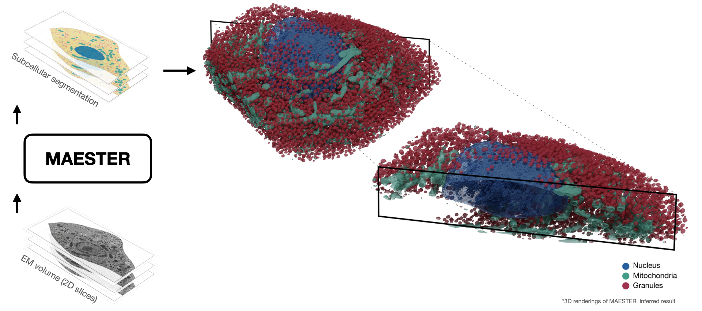

# CVPR2023 Highlight | MAESTER: Masked Autoencoder Guided Segmentation at Pixel Resolution for Accurate, Self-Supervised Subcellular Structure Recognition

Check out the [Paper](https://openaccess.thecvf.com/content/CVPR2023/papers/Xie_MAESTER_Masked_Autoencoder_Guided_Segmentation_at_Pixel_Resolution_for_Accurate_CVPR_2023_paper.pdf)!
and our [Youtube Talk](https://youtu.be/MB2J9eeR0zc)!

## 💥 Introduction

We introduce MAESTER (**M**asked **A**uto**E**ncoder guided **S**egmen**T**ation at pix**E**l **R**esolution), a self-supervised method for accurate, subcellular structure segmentation at pixel resolution. MAESTER treats volume electron microscopy(vEM) image segmentation as a representation learning and clustering problem. Specifically, MAESTER learns semantically meaningful token representations of multi-pixel image patches while simultaneously maintaining a sufficiently large field of view for contextual learning. We also develop a _cover-and-stride_ inference strategy to achieve pixel-level subcellular strueture segmentation.



## ⚙️ Installation

- Clone the repository:

```
git clone https://github.com/bowang-lab/MAESTER
```

- Set up the environment:

```
poetry install
poetry shell
pip install torch==2.0.1 torchvision==0.15.2
```

- Download the trained model for demo

  - Google drive: `https://drive.google.com/drive/folders/143W_VSl5ONE3NGbnI0i19S8lBRml7lRz?usp=sharing`
  - Put it under `./MAESTER/model_weights/`

- Dataset:

  - Download the [betaSeg](https://rupress.org/jcb/article/220/2/e202010039/211599/3D-FIB-SEM-reconstruction-of-microtubule-organelle) dataset by:

  ```
  wget https://cloud.mpi-cbg.de/index.php/s/UJopHTRuh6f4wR8/download
  ```

  - and unzip the dataset, put it under `./MAESTER/data/`

## 🎉 Example

- Check out our detailed demo:
  - Inference with MAESTER `./examples/inference_demo.ipynb`.

## 📝 To-do

- [x] Add inference demo
- [ ] Add scalable inference example
- [ ] Add DDP training example

## 📄 Citation

```
@InProceedings{Xie_2023_CVPR,
    author    = {Xie, Ronald and Pang, Kuan and Bader, Gary D. and Wang, Bo},
    title     = {MAESTER: Masked Autoencoder Guided Segmentation at Pixel Resolution for Accurate, Self-Supervised Subcellular Structure Recognition},
    booktitle = {Proceedings of the IEEE/CVF Conference on Computer Vision and Pattern Recognition (CVPR)},
    month     = {June},
    year      = {2023},
    pages     = {3292-3301}
}
```

## Acknowledgement

- This repository is built upon [MAE](https://github.com/facebookresearch/mae).
